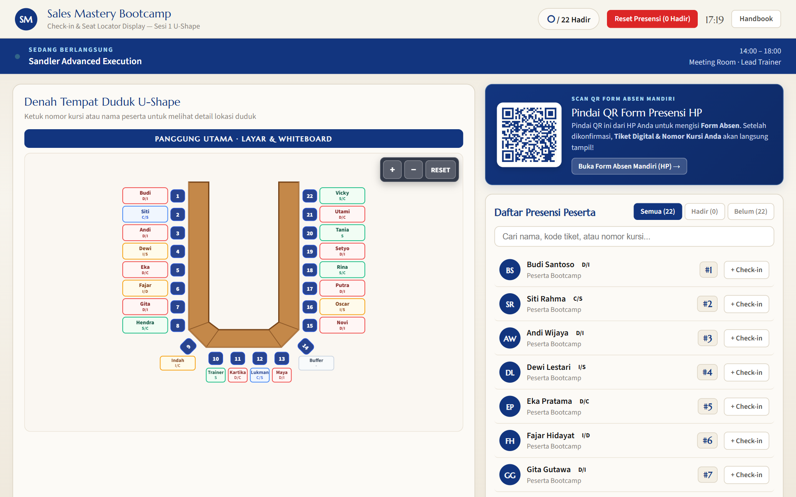
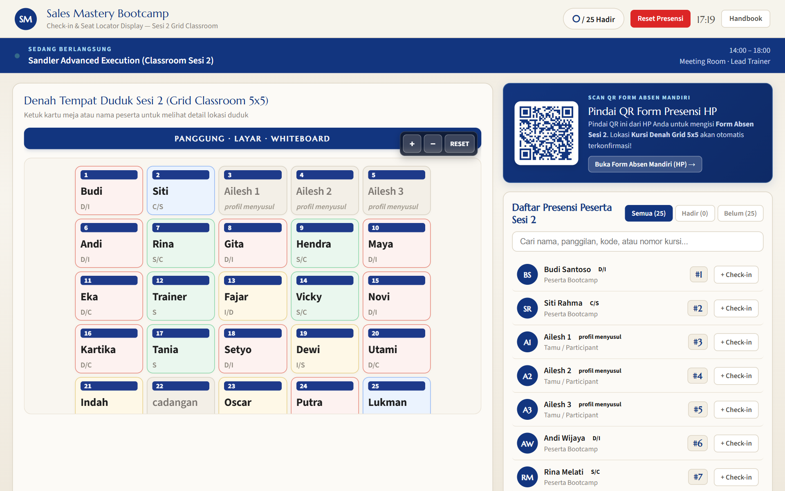

# 📱 Sales Mastery Bootcamp 2026 - Web & Mobile Handbook Application

Aplikasi Handbook Digital & Sistem Presensi Real-Time untuk acara **Sales Mastery Bootcamp 2026** di Kalyana Resort Kaliurang, Yogyakarta.

---

## 🌟 Fitur Utama

- **Digital Handbook Interaktif (`index.html`)**: Panduan lengkap 16 Bab acara mulai dari rundown, dresscode, trainer, akomodasi, hingga armada transportasi kepulangan.
- **Sistem Presensi & Tiket Digital (`checkin.html`)**: Fitur check-in mandiri peserta yang memunculkan tiket pass digital berisi nomor kursi, profil DiSC, tetangga sebelah, info transport kepulangan, serta denah tempat duduk interaktif (dukungan *pinch-to-zoom* & *touch gestures*).
- **Scanner Operator Admin (`scanner.html` & `scanner-grid.html`)**: Dashboard verifikasi presensi peserta via QR Scanner & denah matrix visual status kehadiran.

---

## 📸 Dokumentasi Tampilan Website & Scanner

Lihat dokumentasi lengkap tampilan website (Mobile & Desktop View) untuk setiap section di [DOCUMENTATION_MOBILE.md](./DOCUMENTATION_MOBILE.md).

### Preview Screenshots Aplikasi & Scanner:
| Quick Navigation & Header | Form Presensi Peserta | Tiket Pass Digital |
| :---: | :---: | :---: |
|  |  |  |

| Dashboard Scanner U-Shape (`scanner.html`) | Dashboard Scanner Grid 5x5 (`scanner-grid.html`) |
| :---: | :---: |
|  |  |

---

## 🚀 Cara Menjalankan Project

### 1. Development Mode
```bash
npm install
npm run dev
```

### 2. Build for Production
```bash
npm run build
```

---

## 📄 Struktur Repository

- `index.html` - Handbook Utama Sales Mastery Bootcamp (Bab 01 - 16)
- `checkin.html` - Halaman Presensi & Tiket Digital Peserta
- `scanner.html` - Halaman Pemindai QR Operator
- `scanner-grid.html` - Dashboard Matrix Denah Kursi Real-Time
- `docs/mobile-screenshots/` - Berkas tangkapan layar tampilan mobile
- `DOCUMENTATION_MOBILE.md` - Dokumentasi lengkap visual mobile per section
